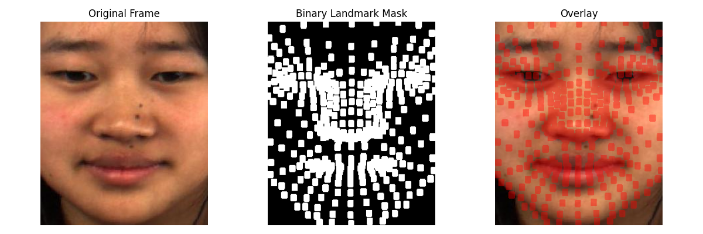
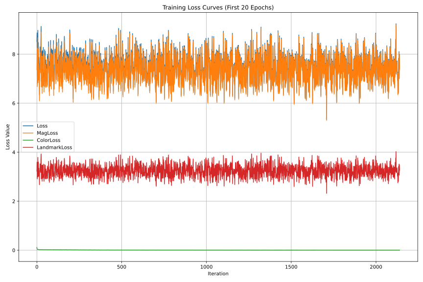

# Face-Aware FlowMag for Micro-Expression Spotting

A research-engineering project that adapts **self-supervised motion magnification** to **micro-expression spotting** on **CASME II**, extended with **face-aware regularization** for more spatially meaningful facial motion amplification.

**Key focus areas:** motion magnification, optical flow, micro-expression analysis, transfer learning, face-aware regularization, neural engineering applications.

## Project Summary

This project adapts the self-supervised FlowMag framework to spontaneous facial micro-expression analysis on CASME II. The main contribution is a face-aware regularization term that uses landmark-based masks to guide motion magnification toward semantically relevant facial regions such as the eyebrows, eyes, nose, and mouth. The system is evaluated using motion error analysis and a downstream LBP-TOP + SVM classification pipeline.

## Overview

Micro-expressions are subtle and short facial movements that often last only a fraction of a second. Because of their low intensity and short duration, they are difficult to detect both visually and algorithmically. This project adapts the **FlowMag** framework for this problem by amplifying subtle facial motion in a controlled and spatially meaningful way.

The repository presents a professional implementation of a motion magnification pipeline for high-speed facial video analysis, with a specific focus on improving micro-expression visibility and supporting downstream evaluation.

## Motivation

The original FlowMag method is designed for self-supervised motion magnification through optical flow consistency. In this project, the method is adapted to the domain of spontaneous facial micro-expressions. The main extension is the addition of a **face-aware regularization strategy** that encourages the model to magnify motion in semantically relevant facial regions rather than amplifying irrelevant background or non-informative motion.

This project sits at the intersection of:

- computer vision
- neural engineering
- biomedical AI
- affective computing
- human-centered machine learning

## Technical Contributions

This repository demonstrates the following contributions:

- adaptation of the original **FlowMag** framework to **CASME II**
- fine-tuning of a pretrained motion magnification model on facial micro-expression data
- integration of **face-aware regularization** using facial landmark-based masks
- support for **test-time adaptation**
- structured comparison between baseline inference, adaptation, and face-aware training variants
- integration with downstream evaluation pipelines based on motion analysis and feature-based classification

## Method Summary

The model takes a reference frame and a target frame and predicts a motion-magnified output.  
The training objective combines motion consistency, appearance preservation, and face-aware regularization.

**Conceptual loss formulation:**

`L_total = L_mag + λ_color * L_color + λ_landmark * L_landmark`

Where:
- `L_mag` for motion consistency
- `L_color` for photometric consistency
- `L_landmark` for spatial guidance in facial regions

## Dataset

This project is built around the **CASME II** dataset, a benchmark dataset for spontaneous micro-expressions recorded at high frame rate.

> **Important:** The dataset is **not included** in this repository.  
> Users must obtain CASME II separately and place it in the expected data directory.

## Repository Structure

```text
face-aware-flowmag-microexpression/
├── README.md
├── LICENSE
├── .gitignore
├── requirements.txt
├── environment.yml
├── configs/
├── src/
│   ├── __init__.py
│   ├── dataset.py
│   ├── model.py
│   ├── losses.py
│   ├── flow_utils.py
│   ├── inference.py
│   ├── test_time_adapt.py
│   ├── train.py
│   ├── myutils.py
│   └── models/
├── scripts/
├── data/
│   ├── raw/
│   ├── processed/
│   └── masks/
├── checkpoints/
├── outputs/
├── evaluation/
├── docs/
└── assets/
```

## Core Components

- `src/train.py` — training pipeline for fine-tuning the model on the target dataset
- `src/inference.py` — inference script for generating motion-magnified outputs from input frame sequences
- `src/test_time_adapt.py` — test-time adaptation for sequence-specific refinement
- `src/model.py` — main motion magnification model definition
- `src/losses.py` — loss functions, including magnification and face-aware regularization terms
- `src/dataset.py` — dataset loading and frame preparation utilities
- `src/flow_utils.py` — optical flow helper functions for training and inference

## Installation

Clone the repository and install the dependencies:

```bash
git clone https://github.com/HeisenbergSY/face-aware-flowmag-microexpression.git
cd face-aware-flowmag-microexpression
pip install -r requirements.txt
```

## Environment Notes

This project was originally developed with the dependency versions listed in `requirements.txt`, including:

- `torch==1.7.0`
- `torchvision==0.8.1`

Because these versions are relatively old, users working with newer Python, CUDA, or PyTorch environments may need to adapt parts of the setup.

## Data Setup

The dataset is not redistributed with this repository.

Expected structure:

```text
data/
├── raw/
│   └── CASME2/
├── processed/
└── masks/
```

Suggested usage:

- place original CASME II frame data under `data/raw/CASME2/`
- place processed frame sequences under `data/processed/`
- place generated facial landmark masks under `data/masks/`

## Training Setup

The training pipeline was adapted to the CASME II dataset, which contains **247 samples** from **26 subjects**, recorded at **200 fps** with an original spatial resolution of **640 × 480**. For training efficiency and consistency, all facial frames were resized to **256 × 256**.

### Training configuration

- input size: `256 × 256`
- sequence length: `8` consecutive frames
- magnification factor: `α = 20`
- optimizer: `Adam`
- learning rate: `1e-4`
- batch size: `4`
- loss weights: `λ_color = 1.0`, `λ_landmark = 2.0`
- early stopping patience: `5`
- random seed: `2` 

### Transfer learning strategy

The model was fine-tuned from pretrained FlowMag weights. To preserve the motion representation learned from generic video data, the encoder and middle block were frozen, while only the decoder layers were updated during training. This was done to reduce overfitting and specialize the model for subtle facial motion in CASME II. 

## Evaluation Protocol

The repository supports evaluation through motion error analysis, LBP-TOP feature extraction, and SVM-based classification under subject-aware validation protocols. The repository evaluates motion magnification as a **downstream micro-expression analysis task** rather than only as a visual enhancement problem. The evaluation pipeline uses **LBP-TOP** feature extraction followed by **SVM** classification, with motion fidelity additionally assessed using **RAFT-based motion error**. 

### Evaluated conditions

The following five conditions were compared:

- original CASME II sequences
- pretrained FlowMag inference
- FlowMag with test-time adaptation (TTA)
- face-aware model with `λ_landmark = 2`
- face-aware model with `λ_landmark = 5` 

### Classification pipeline

For downstream recognition, each original or magnified sequence is processed through:

1. LBP-TOP feature extraction
2. linear SVM classification
3. subject-aware cross-validation using `LOGO` 

### Final protocol choice

Multiple protocols were compared, including Hold-Out, LOO, LOSO, and LOGO. The final reference protocol used in the thesis was **LOGO**, because it provided subject-aware separation, reproducibility, and close alignment with the original CASME II benchmark behavior. 

## Training

Example training command:

```bash
python -m src.train
```
Additional training configurations can be placed in the `configs/` folder.

## Inference

Example inference command:

```bash
python -m src.inference
```
This script generates motion-magnified frame sequences or videos from selected input frames.

## Test-Time Adaptation

This mode adapts the model at inference time for sequence-specific refinement.
Example command:

```bash
python -m src.test_time_adapt
```

## Visual Examples

### Landmark-aware mask visualization


### Training loss curves


## Experimental Focus

The project compares several settings:

- pretrained baseline inference
- test-time adaptation
- face-aware fine-tuning
- multiple landmark regularization strengths

This supports analysis of both:

- visual quality of motion amplification
- downstream utility for micro-expression analysis

## Key Findings

- Direct inference with the pretrained FlowMag model achieved the lowest motion error.
- Face-aware regularization improved spatial interpretability of amplified facial motion.
- Moderate regularization provided better behavior than stronger landmark weighting.
- Stronger regularization degraded downstream classification performance.
- Overall, the face-aware approach improved interpretability but did not outperform the pretrained baseline in classification accuracy.

## Skills Demonstrated

This repository highlights experience in:

- deep learning for video understanding
- self-supervised learning
- optical flow-based modeling
- transfer learning on small specialized datasets
- face-aware spatial regularization
- research engineering
- reproducible project structuring
- experiment design and technical documentation

## Relevance for Neural Engineering

Although the project is based on computer vision, its broader relevance lies in signal amplification, subtle pattern detection, and interpretable analysis of human facial behavior. These themes are highly relevant to neural engineering, biomedical AI, and human-centered sensing systems.

## Limitations

- CASME II is a relatively small dataset
- performance depends on optical flow quality
- environment compatibility may require updates on modern systems
- downstream performance gains from regularization may vary depending on evaluation protocol

## Future Work

Potential future extensions include:

- attention-based spatial regularization
- transformer-based motion modeling
- end-to-end downstream classification
- extension to additional micro-expression datasets
- integration with broader behavioral or physiological analysis systems

## For Recruiters and Employers

This project demonstrates the ability to:

- understand and adapt a recent research method
- translate theory into a working codebase
- structure a research project as a reproducible engineering repository
- work across model design, training, inference, evaluation, and documentation

It reflects applied experience in deep learning, scientific programming, and domain adaptation for subtle human signal analysis.

## Citation

If you use this repository in academic work, please cite:

- the original FlowMag paper
- the CASME II dataset paper

## Contact

**Adnan Tawkul**  
Master’s specialization: **Neural Engineering**  
Interests: **computer vision, biomedical AI, neural engineering, affective computing, motion analysis**